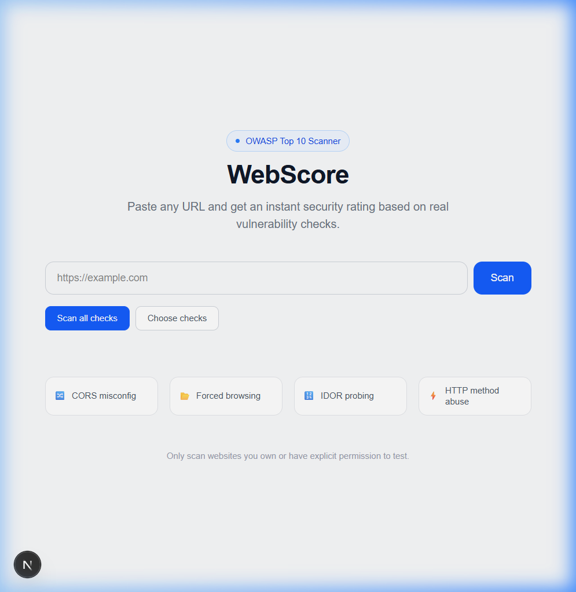
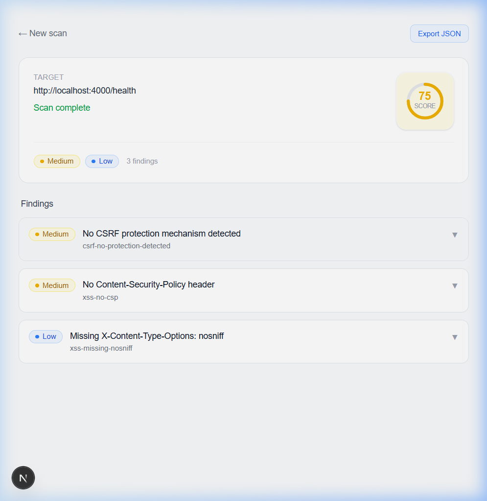
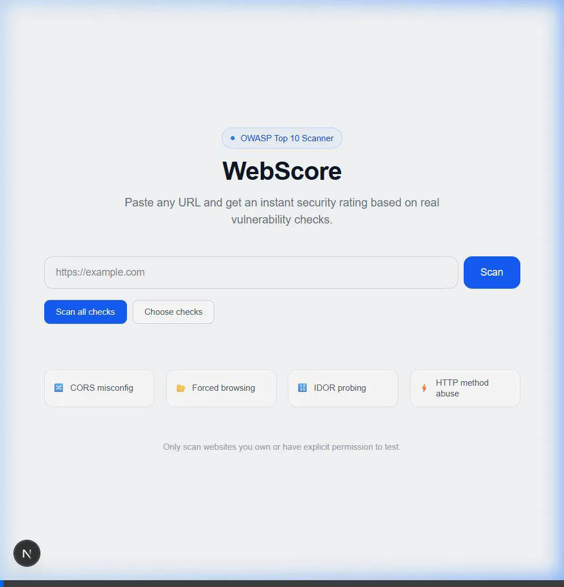

# Walkthrough - Development Environment Execution & Demo Scan

This file documents the local execution of the development environment for the **WebScore: OWASP Top 10 Security Scanner** monorepo, including a live demo scan.

## Services Started

1. **Turborepo Dev Pipeline** (`pnpm dev`):
   - **Next.js Frontend (`apps/web`)**: Started on [http://localhost:3000](http://localhost:3000).
   - **Fastify API Server (`apps/api`)**: Listening on `http://0.0.0.0:4000`.
   - **Background Scan Worker**: Started and connected to Redis, listening for scan jobs.

---

## Verification & Demo Scan

The WebScore frontend dashboard was verified and a live demo scan was executed against the local API server's health check endpoint.

### 1. Initial State Dashboard
- **Page Status**: Loaded with a 200 OK status.
- **Key Interface Components Found**:
  - Target URL input field (placeholder: `"https://example.com"`)
  - **Scan** button
  - Scan modes (`Scan all checks`, `Choose checks`)
  - Configurable vulnerability checks list

### 2. Executing Demo Scan
- **Target URL**: `http://localhost:4000/health` (the API server's health check endpoint)
- **Execution**: Initiated the scan from the UI. The dashboard successfully redirected to the scan details page where status changes polled in real time.
- **Scan Result**: Completed successfully with a **Security Score of 75/100**.

#### Findings Detected
*   🛑 **CRITICAL**: 0
*   🟠 **HIGH**: 0
*   🟡 **MEDIUM**: 2
    *   **No CSRF protection mechanism detected** (`csrf-no-protection-detected`)
    *   **No Content-Security-Policy header** (`xss-no-csp`)
*   🔵 **LOW**: 1
    *   **Missing `X-Content-Type-Options: nosniff` header** (`xss-missing-nosniff`)
*   ⚪ **INFO**: 0

### 3. Demo Scan Video Recording
A video recording showing the entire process of typing the target URL, initiating the scan, and observing the results page updates is available here:

